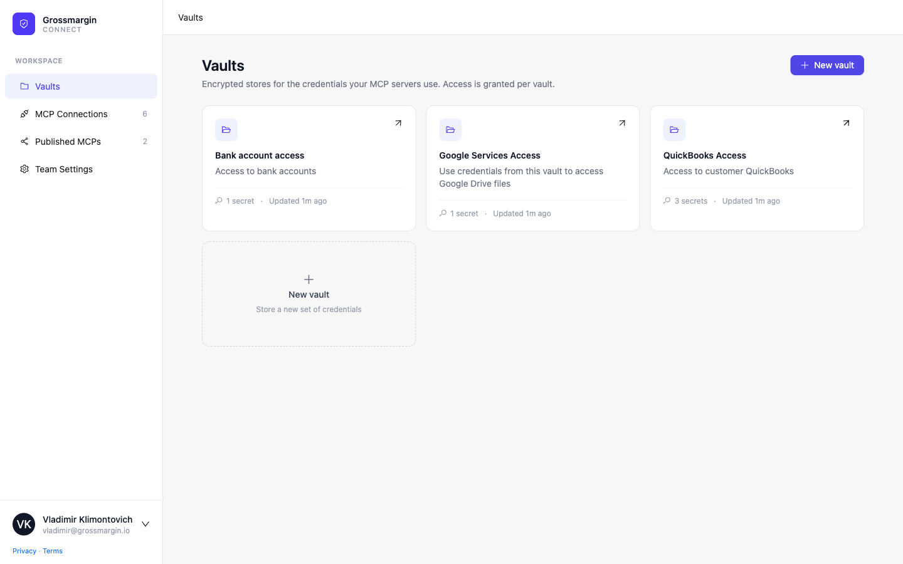
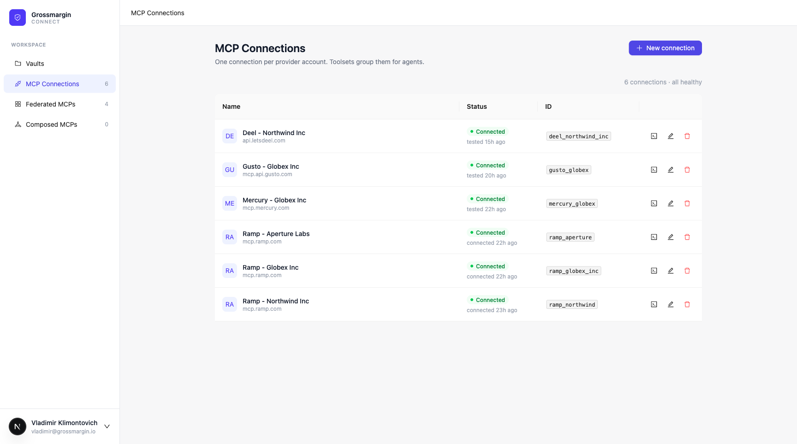
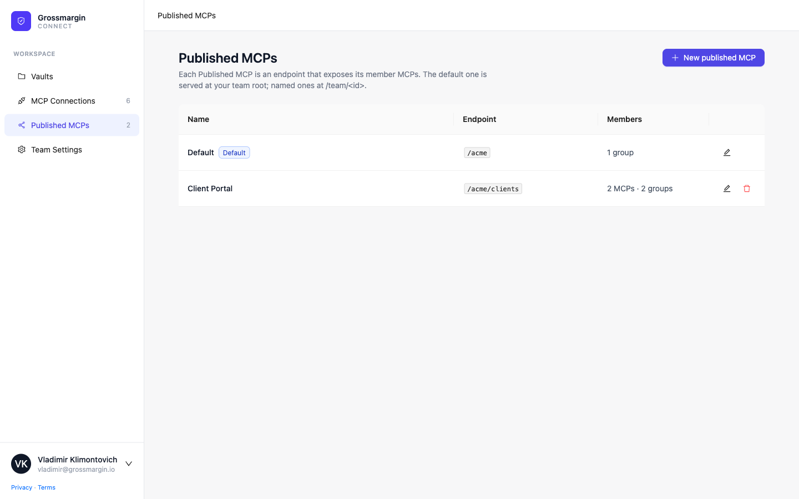
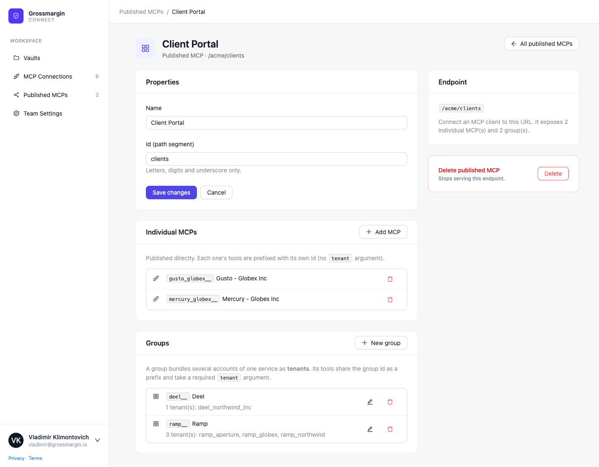
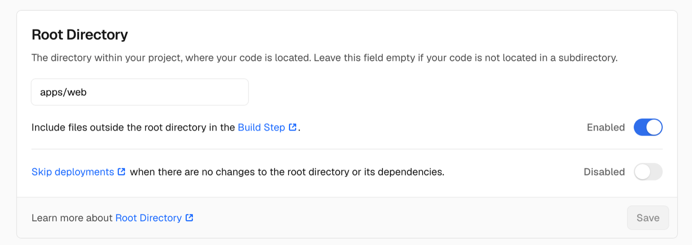

# Grossmargin Connect

Grossmargin Connect is an MCP server that fills two gaps in the MCP connectors built for Claude and
Claude Cowork.

- **Provider connectors are single-account.** If you manage several companies in one provider (for
  example Deel, Gusto, Ramp), you can connect only one, and Claude cannot mount two instances of the same MCP. This
  blocks agencies that manage many client accounts. **Bundled MCPs** with **groups** (see below) solve it.
- **Stock MCP connectors expose less than the API behind them.** For example, the Google Drive connector
  cannot edit cell values in a Sheet, but the Google Sheets API can. The fix is to hand the agent the
  raw credentials, safely. This part is a "missing 1Password MCP": you store a credential once, and
  Connect exposes tools to reveal it to the agent. **Vaults** and **Credentials** handle it.

Built with Next.js, Prisma, and Postgres.



## Bundled MCPs

A **bundle** (Bundled MCP) is an MCP endpoint that exposes a set of members. A member is one of:

- an **individual MCP** — one connection, whose tools are served under its own `<id>__` prefix; or
- a **group** — several connections of the same provider, served under one `<id>__` prefix. Each
  connection is a **tenant**, and the agent picks one per call with a required `tenant` argument.

A bundle also chooses which **vaults** its credential tools expose: all team vaults (minus optional
exceptions), or an explicit allow-list. See [Vaults and Credentials](#vaults-and-credentials).

The default bundle is served at your team root (`/<team>`); named ones at `/<team>/<id>`.

Set one up in two steps:

1. Add one **MCP Connection** per provider account. Each connection authenticates on its own, by OAuth
   (Dynamic Client Registration + PKCE) or by static headers (a Personal Access Token).

   

2. Create a bundle and add members: individual MCPs, and groups for the providers where you have
   several accounts.

   

   

For a group, the agent calls `<id>__tenants` to list the accounts, then passes one `tenant` id on each
tool call. An individual MCP is called directly — no `tenant` argument.

The proxy forwards tools, resources, and prompts. It does not support streaming, sessions, or several
other MCP features, and it applies per-call timeouts. See [Proxying limitations](docs/limitations.md)
for where a downstream server won't work fully.

## Vaults and Credentials

A **Vault** is an encrypted store of credentials. Access is granted per vault, to a team.

A **Credential** has a `name`, a `description`, and a `type`:

- `SINGLELINE` / `MULTILINE` — a secret you store directly. The content is encrypted at rest with
  AES-256-GCM; the name, description, and type stay in plaintext.
- `NANGO` — no secret is stored. The credential points at a [Nango](https://nango.dev) connection, and
  Connect fetches a live, auto-refreshed OAuth token on each read. Needs `NANGO_SECRET_KEY`.

Agents reach vaults through the root MCP server at `/mcp`, with three tools:

- `get_vaults` — vaults you can access.
- `get_credentials(vaultId?)` — credential metadata (never the content).
- `view_credential(credentialId)` — the decrypted content, or a live Nango token. Every reveal is
  written to the audit log.

Each [bundle](#bundled-mcps) chooses which vaults these tools expose, so a named endpoint can serve a
subset of the team's vaults.

## Deployment

Deploy on Vercel, or on any host that runs Docker images. You need a Postgres database and a Google
OAuth client. On Vercel the schema is applied during the build; on Docker you apply it yourself with
`bun run db:push` (see below). Either way, creating the first team is manual — there are no invitations
yet.

### Environment variables

Copy `apps/web/.env.example` to `apps/web/.env` (local), or set these in your host's dashboard:

| Variable | Purpose |
| --- | --- |
| `DATABASE_URL` | Postgres connection string. |
| `ENCRYPTION_KEY` | AES-256-GCM keys, comma-separated 32-byte base64, newest first. `openssl rand -base64 32`. Rotate by prepending a new key; old rows still decrypt. |
| `AUTH_SECRET` | NextAuth secret. `openssl rand -base64 32`. |
| `AUTH_GOOGLE_ID` / `AUTH_GOOGLE_SECRET` | Google OAuth client. |
| `AUTH_ALLOWED_DOMAINS` | Optional. Comma-separated Google Workspace domains allowed to sign in. Unset = any Google account. |
| `APP_URL` | Public base URL of the app. |
| `NANGO_SECRET_KEY` | Optional. Needed only for `NANGO` credentials. |

### Google OAuth client

1. In the [Google Cloud Console](https://console.cloud.google.com/apis/credentials), create an
   **OAuth client ID** of type **Web application**.
2. Add the redirect URI `${APP_URL}/api/auth/callback/google` (for local dev,
   `http://localhost:3000/api/auth/callback/google`).
3. Copy the client id and secret into `AUTH_GOOGLE_ID` and `AUTH_GOOGLE_SECRET`.

### Deploy on Vercel

1. Import the repo into Vercel.
2. Set the **Root Directory** to `apps/web`. This is the only non-default setting — the repo is a
   monorepo and the app lives in `apps/web`. Keep "Include files outside the root directory in the Build
   Step" enabled so the build can read the workspace root (`package.json`, `bun.lock`).

   

3. Add the [environment variables](#environment-variables).
4. Deploy. The build command (`apps/web/vercel.json`) runs `prisma db push` before `next build`, so the
   schema is applied on every deploy.

### Deploy with Docker

The image serves the app only; it does not migrate the database. Apply the schema first — and again
after any schema change — from a checkout, with the production `DATABASE_URL`:

```
DATABASE_URL=postgresql://... bun run db:push
```

Then build and run:

```
docker build -t grossmargin-connect .
docker run -p 3000:3000 --env-file apps/web/.env grossmargin-connect
```

See [Develop](#develop) for running it locally.

### First run: create a team and sign in

1. Open `APP_URL` and sign in with Google. A first login creates a `User` with no team.
2. Create a team:

   ```sql
   INSERT INTO "Team" (id, name, "createdAt") VALUES (gen_random_uuid(), 'Acme', now());
   ```

3. Add the user to the team (repeat for every new member):

   ```sql
   INSERT INTO "TeamMembership" (id, "userId", "teamId", "createdAt")
   SELECT gen_random_uuid(), u.id, t.id, now()
   FROM "User" u CROSS JOIN "Team" t
   WHERE u.email = 'you@example.com' AND t.name = 'Acme';
   ```

## Develop

```
bun install
cp apps/web/.env.example apps/web/.env   # fill in values
docker run -d --name connect-db -e POSTGRES_PASSWORD=postgres -e POSTGRES_DB=credentials -p 5432:5432 postgres:16
bun run db:push
bun run dev
```

## License

[MIT](LICENSE).
